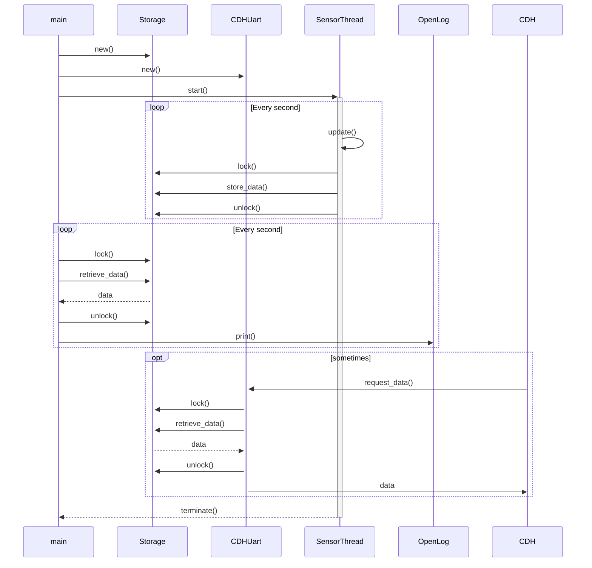

# MOVE-ON Helium Sensors IRR Documentation
This is the IRR report from the Sensors subsystem of the MOVE-ON Helium mission.

Members of the Sensor team are:
* Florian Mauracher (<florian.mauracher@tum.de>)
* Tejas Kale (<tejas.kale@tum.de>)
* Alexander Lill (<alexander.lill@tum.de>)

## Resources & TL;DR
* [Repository](https://gitlab.lrz.de/move-on/move-on_helium_sensors)
* [System Architecture](https://gitlab.lrz.de/move-on/move-on_helium_sensors/blob/master/doc/system-architecture.png)
* [Nucleo Firmware](https://gitlab.lrz.de/move-on/move-on_helium_sensors/tree/master/src)
* [Hardware Schematics](https://gitlab.lrz.de/move-on/move-on_helium_sensors/tree/master/hardware)
* [Live data visualization](https://move.frcy.org)


## Mission Overview (MOVEON-GENERAL)
The MOVE-ON project aims to develop and start a high altitude pseudo satellite (HAPS) on board of a high-altitude (stratospheric) balloon every half year. This serves as a platform for short-lived and cost-efficient experiments to verify and test spacecraft technologies.

The expected mission duration for a high altitude balloon flight is 4 to 6 hours during which the balloon reaches an altitude up to 35 km.

The project is carried out by students of the [WARR](https://www.warr.de/en) (Scientific Workgroup for Rocketry and Spaceflight - German: Wissenschaftliche Arbeitsgemeinschaft für Raketentechnik und Raumfahrt in cooperation with the [LRT](https://www.lrt.mw.tum.de) (Chair of Astronautics) of the Technical University of Munich.

Suitable scientific or technical payloads are developed by students, employees of the LRT or provided by external partners and are the main driver for the technical requirements of every balloon mission.

MOVE-ON leverages existing knowledge from previous satellite missions of the chair and prepares the team as well as new technologies for upcoming satellite generations.

### Strategic Mission Goals (MOVEON-GENERAL)
MOVE-ON is the follow-up mission of the [MOVE-II](https://www.move2space.de/MOVE-II) miniature satellite (CubeSat) that was developed by the LRT together with students of the WARR.

The MOVE-ON missions are intended as a transitional project until the next satellite mission and aim to pass existing knowledge of the development of small satellites to a new generation of students and deepen their understanding of related technologies.

Besides distributing in-depth technical knowledge it also focuses on the upkeep and improvement of established processes and tools in regards to hardware and software.
Leveraging the relatively short and repeated development cycles (in comparison to small satellites) it additionally aims to create an adapted strategy for the agile development of embedded systems on small satellites.

### Technical Goals (MOVEON-GENERAL)
Existing technologies of previous and current satellite missions are intended to be used, extended and tested whenever possible.
Additionally, the continuous in-house development of the central subsystems for small satellites improves the capabilities of the LRT and the WARR in the development, manufacturing and qualification of satellite technology.
New strategies for the design and development of embedded systems can be tested rapidly with minimal cost and small associated risks.


## MOVE-ON Helium System Overview (MOVEON-HE-GENERAL)
The MOVE-ON Helium mission consists of a balloon, connecting strings and a gondola with a payload mounted on top of the gondola. The gondola is a PVC box and consists of all the mission-critical components including power, communication and health monitoring systems. The box serves to insulate the electronics from the extremely cold temperatures in the stratosphere.

The system is split into several key subsystems. Such a modular architecture allows for a structured development approach where each subsystem is developed and tested independently.


 The MOVE-ON Helium balloon has the following subsystems interconnected as shown in the figure above:

Command and Data Handling (CDH)
:   The CDH subsystem is the brain of the gondola. It controls all the other subsystems via various interfaces. CDH controls the power to the various systems and can switch off noncritical systems when the batteries run low or a subsystem is malfunctioning. Data from the sensors system is used for monitoring the health of the gondola and also its GPS position. CDH downlinks this telemetry data via the COM subsystem to the ground station.

Sensors (SEN)
:    The sensors subsystem provides environmental data and system health information for monitoring and tracking the balloon. It houses various sensors including a GPS module which provides the real-time position of the balloon.

Electrical Power System (EPS)
:   EPS houses the batteries, solar cells and the voltage converters. It is responsible for providing power to all the other subsystems. The EPS is designed in a modular way such that multiple such systems can be plugged in to scale to the needs of the mission. [ref: Thomas Grübler (12.2017) "Highly Integrated Smart Satellite Panels for Commercial Space Applications"]

Communications (COM)
:   The COM system consists of an RF link and is responsible for sending telemetry data from the balloon to the ground station.

Camera (CAM)
:   The camera system houses a GoPro capturing cool photos from the edge of space.

Payload (PL)
:   Payload is the scientific payload that is the main purpose of this balloon mission. It is mounted on top of the gondola and sends its data to CDH for transmission to the ground station.

Over the past 2 months, we have worked on developing the Sensors subsystem, starting from selecting commercially available components to integrating all of them on a single PCB. This subsystem is described in detail in the next section.

## Sensors Subsystem

The main responsibility of the sensors subsystem is to collect data from all connected sensors and provide this data to the CDH subsystem upon request. Simultaneously the collected data is stored locally at a higher data rate for later analysis.
The figure below shows the key components of the subsystem and the connections between them.


* Internal Board, containing
    * Microcontroller (NUCLEO-L432KC)
    * Storage Module (Adafruit OpenLog)
    * GPS module (uBLOX MAX-M8C Pico)
    * Motion sensor (BNO055)
* External Boards, containing
    * Environmental sensor (BME680)
    * Sun Sensor (MOVE-II ADCS Sidepanel)
    * Sun Sensor (TOSS Photodiode board)
* Distributed on Gondola
    * Temperature sensors (DS18B20)

The internal board is a self-developed PCB which is mounted on the inside of the gondola. The external board is mounted on the exterior of the gondola and is connected over SPI to the microcontroller. Multiple temperature sensors are placed near critical components of the gondola and also on the outside of the gondola.

Each component is connected to the microcontroller using one of the  following communication buses, depending on what the sensor supports:
* UART
* I^2^C
* SPI
* OneWire

### Hardware
Since this is a proof of concept mission for the new sensors microcontroller, breakout boards are used for the majority of components. This enables fast prototyping and easy development.

For the initial verification of all components and connections the breakout boards were combined on a single breadboard as visible on the image below.


After successful verification, a PCB was designed integrating all internal breakout boards and providing dedicated connectors for each external component. The hardware schematics are available in the [repository](https://gitlab.lrz.de/move-on/move-on_helium_sensors/tree/master/hardware).


In the future all of the internal sensors could be integrated onto a single PCB which would significantly decrease the physical dimensions and weight of the board.

#### Microcontroller (NUCLEO-L432KC)
Our main computing module is a NUCLEO-L432KC development board with the following features:

* STMicroelectronics STM32L432KC microcontroller in 32-pin package
* ARM Cortex M4 architecture with FPU
* Adjustable CPU frequency from 2-80 Mhz
* 256 KB Flash and 64 KB SRAM
* Support for the ARM mbed OS Real-time operating system (RTOS)
* On-board ST-LINK/V2-1 debugger/programmer

The ARM Cortex M4 based microcontroller was chosen due to its low base power consumption with reduced clock frequency while still offering sufficient processing power for higher level abstractions and possible future data processing.

### Software

#### Operating System
While the previously developed MOVE-II ADCS system is based on an Atmel ATxmega256A3U and was developed in a bare-metal fashion without existing libraries or an operating system, the MOVE-ON Sensor board is using the ARM Mbed OS real-time operating system.

Mbed OS provides a convenient abstraction for the complexity of the underlying ARM Cortex-M4 microcontroller.

The RTOS functionality of Mbed OS with its priority based scheduling allows event-based actions with a guaranteed response rate and multiple concurrent threads with different priorities.

#### Data Acquisition

<!--
```https://www.planttext.com/
@startuml

class Sensors {
  -BNO055IMU imu;
  -BME680 env0;
  -BME680 env1;
  -Sidepanel adcs;
  -DS18B20 temperature;
  -GPS gps;
  -Storage storage;
  -CDHUart cdhuart;
  +void setup();
  +void loop();
  +void log();
}

class SensorThread {
  +void start()
  +void loop()
  +bool setup()
  +void update()
  +void set_update_rate(int)
  +void set_priority(priority)
  -Thread _thread
}

class BNO055IMU
class BME680
class Sidepanel
class DS18B20
class GPS

SensorThread <|-down- BNO055IMU: Inheritance
SensorThread <|-down- BME680: Inheritance
SensorThread <|-down- Sidepanel: Inheritance
SensorThread <|-down- DS18B20: Inheritance
SensorThread <|-down- GPS: Inheritance

Sensors "1" -right- "*" SensorThread: "      "

@enduml
```
-->




To gather the data from multiple different sensors, each sensor is implemented as a self-contained module in the form of a separate class containing all its dependencies.
To support varying data refresh rates for each sensor each module runs in a separate thread relying on Mbed OS for scheduling between the threads.

Each sensor thread communicates with its respective sensor to initiate a measurement when required and gather the resulting data.The data is then stored in a shared data structure containing the latest measurements from each sensor. To ensure the data structure remains consistent at all times a mutex is used to lock the data structure immediately before storing the data and unlock it again right afterwards.

At the end of a measurement period each sensor thread sleeps for the remaining time until the desired data update rate is reached, providing sufficient time for all other sensor threads to be scheduled.

#### Sensor Update Frequency

| Sensor       | Update Frequency(ms) |
| --------     | --------   |
|   GPS        | 1000       |
|   BME        | 1000       |
| BNO055-IMU   | 200        |
|  SidePanel   | 200        |
|   TOSS       | 500        |
|One Wire Temp | 2000       |


#### CDH Communication
CDH asks the sensors system for data every second over the UART link by sending a single command byte. The response is a mutually agreed upon data structure which contains the most recent sensor data. The content is verified with a CRC checksum to avoid data corruption.

As GPS data is critical for real-time balloon tracking and time synchronization, responding to CDH data requests is handled with a high priority event queue. When a new request for data comes in from CDH (a byte is received on the UART RX line), an interrupt is generated by the UART peripheral on the microcontroller. The interrupt handler simply reads the command and queues an event onto the event queue for processing. The event callback is then executed when the responsible thread gets scheduled the next time. The command processor then responds with the sensor data on the UART TX line.

#### Persistent Data Storage
A UART data logger module is used to log data locally on the sensors subsystem. This is required because:

- CDH cannot handle data at high frequency due to power budget constraints
- Different sensors produce different amounts of data at different rates
- In case of a CDH failure, we will still have a backup of the sensor data

This is implemented using the OpenLog module from [Sparkfun](https://www.sparkfun.com/products/13712). It is an Atmel Xmega 328p microcontroller which logs all data that it receives via UART to an SD card. The used SD card has a capacity of 32 GB and provides sufficient storage capacity for up to a month of continuous data storage ( `115200/8*60*60*24/1024/1024/1024` = 1.15 GB/day with 100% utilization of the UART line).


### Sensors
The following sensor modules are integrated into the sensors subsystem:

#### GPS Module (uBLOX MAX-M8C Pico)
The MAX-8 series of standard precision GNSS modules features the reliable performance of the u-blox 8 positioning engine, which receives GPS, GLONASS, QZSS and SBAS signals. The MAX-8 series delivers high sensitivity and minimal acquisition times in an ultra compact form factor. The MAX-8 series provides high sensitivity while featuring low power consumption. It also supports advanced Power Save Modes. It also provides message integrity protection, geofencing, spoofing detection, and odometer functionalities. The module also supports a high altitude mode which works up to 50 km in flight mode.

The module is connected to the microcontroller over a dedicated I^2^C bus. It provides GPS data in the standard NMEA format. This raw NMEA is parsed to extract the time and real-time GPS position. Since NMEA also consists of other useful data, it is also logged in raw form.

For configuration of the sensor module, the uBLOX supports a proprietary binary protocol. This protocol is currently neither used nor implemented, but instead configuration messages can be created using a software provided by uBLOX to generate these binary messages which can then be written to the module over I^2^C.

#### Motion Sensor (BNO055)
The Bosch Sensortec BNO055 motion sensor implements an intelligent 9-axis Absolute Orientation Sensor, which includes sensors and sensor fusion in a single package. This sensor integrates a triaxial 14-bit accelerometer, a triaxial 16-bit gyroscope with a maximum range of ±2000 degrees per second, a triaxial geomagnetic sensor and a 32-bit microcontroller running the company's BSX3.0 FusionLib software. The BNO055 is connected over a second I^2^C bus.

Attitude data from this sensor is used to measure the orientation of the gondola and also to test the effectiveness of a stabilization system developed by the structure team. This data is also used to mark the exact time when the balloon bursts and the gondola starts its free fall.

#### Environmental Sensor (BME680)
The Bosch Sensortec BME680 is described as an environmental sensor and provides, besides measurements of the temperature, humidity and pressure also an estimate of the current air quality in the form of a gas resistance measurement. The sensor provides an SPI interface for configuration and data retrieval.

While there are multiple Arduino libraries available to communicate with the sensor, no resources were available for Mbed OS. After some refactoring and multiple upstream pull requests an [existing library from GitHub](https://github.com/Flowm/ClosedCube_BME680) was used to avoid reimplementing all necessary configuration and data processing steps.

#### Sun Sensor (MOVE-II ADCS Sidepanel)
Sun angle sensors used in the MOVE-II CubeSat are commercial-off-the-shelf components, which are not extensively tested for space operation. The MOVE-ON mission provides an excellent platform for testing the performance of these sensors in a space-like environment. One of the side panels from the MOVE-II CubeSat is attached to the exterior of the gondola to record data from the sun sensor attached to it. This panel also has an IMU and various temperature sensors. Data from these is also recorded.

The sidepanel is connected over the same SPI bus that connects all the external components of the sensor subsystem. It operates as a SPI slave and responds to data requests from the Nucleo microcontroller. The sidepanel has the same software version as on the MOVE-II satellite.

#### Sun Sensor (SFH 2430)
A separate component with multiple photodiodes arranged in a spherical manner is being developed by students of the [*Practical Course on Astronautics*](https://www.lrt.mw.tum.de/index.php?id=172&L=1).

This experimental payload aims to provide a primitive sun sensor by combining the measurements of the photodiodes and some supplemental temperature sensors. An [Atmel AtMega32u4 breakout](https://www.dfrobot.com/product-1075.html) combines these measurements and provides a calculated sun vector as well as the raw data over a SPI interface to the Nucleo sensor board.

#### Temperature Sensors (DS18B20)
The DS18B20 digital thermometer provides 9-bit to 12-bit Celsius temperature measurements from -55°C to +125°C with a 0.5°C accuracy from -10°C to +85°C. This sensor communicates over a 1-Wire bus that by definition requires only one data line (and ground). In addition, the DS18B20 can derive power directly from the data line ("parasite power"), eliminating the need for an external power supply. The 1-Wire protocol required for interfacing with this sensor is implemented in software using an mbed library.

### Development Environment
While each team member has his own Nucleo board and the sensor he's currently working on, most sensors were only available twice during development. To allow regular testing of all components in a combined setup, we set up a continuous integration and deployment pipeline based on GitLab and the GitLab Runner.

After every commit the GitLab Runner starts the docker container with the mbed-cli development environment, compiles the project and gathers the resulting firmware as an artifact. The next stage of the pipeline then uses this firmware image to flash the Nucleo microcontroller with all sensors attached which is connected to an Raspberry PI reachable from the build server. Additionally, debug output is captured over the USB serial port and logged in the build log.

### Data Visualization

In the FlatBal (Flat Balloon) configuration, the Raspberry Pi logs data on the USB debug line of the Nucleo board, which is used by OpenLog in the flight configuration. This data is then parsed by a Python script, published over the messaging protocol MQTT and stored as time series in an InfluxDB database. The Grafana web frontend provides an interactive visualization of the stored data.


InfluxDB supports multiple data sources and can easily be extended to accept data received over the COM link for live telemetry and tracking in flight.

### Power
Currently the sensors subsystem with all sensors connected consumes an average of 326 mW. Although there are no hard power requirements for the power budget of the sensors system energy consumption was kept in mind throughout the component selection and development process.

Nevertheless there are certain components that require significant amounts of energy making the overall consumption appear high:

|Component | Consumption | Disclaimer |
|- | - | - |
|uBlox GPS | <74 mW | During GPS acquisition|
| OpenLog | <70 mW | When writing to SD card flash |
|MOVE-II ADCS Sidepanel | ~60 mW | Separate XMega uC |
|TOSS Photodiode | ~50 mW  | Separate AVR uC |
|Microcontroller + Sensors | *~72mW* | *Approximate value, naively calculated* | <!-- 326-74-70-60-50 -->
|**Sum** | **326 mW** | |


## Status
All described sensors and components (except the TOSS board) are integrated and working. Data is provided to the CDH system on demand. The whole setup has been running in a FlatBal configuration for multiple weeks and reliably generates data which has been analyzed using the Grafana visualization.

Concluding this status report the sensors team acknowledges potential for improvement, but is sure that this system is "Go!".

## References
#### Sensor Modules
* [Components List](https://docs.google.com/spreadsheets/d/1G8NeRl4uM_pISfbMc-lu1pe1I8vzOqsSfUeEpfeaWEo/edit#gid=0)
* [GPS Ublox Max M8](https://store.uputronics.com/index.php?route=product/product&path=60_64&product_id=72)
* [BNO055 IMU](https://www.adafruit.com/product/2472)
* [BME680 Enviornment](http://www.watterott.com/en/BME680-Breakout)
* [DS18B20 Temperature](https://datasheets.maximintegrated.com/en/ds/DS18B20.pdf)
* [MOVE-II ADCS SidePanel](https://redmine.move2space.de/projects/move2/wiki/Sidepanel_401)
* [Open Log Datalogger](https://www.sparkfun.com/products/13712)

#### Source Code
* [MOVE-ON Helium Sensors](https://gitlab.lrz.de/move-on/move-on_helium_sensors/)
* [MOVE-II ADCS](https://gitlab.lrz.de/move-ii/adcs_software)
* [TOSS Sunsensor](https://gitlab.lrz.de/racoon-projects/thermal-sun-sensor)
